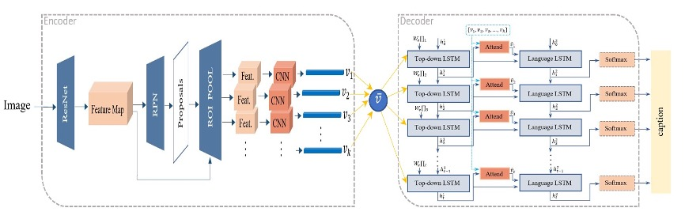

# Arabic-bottomUp-topDown-imageCaptioning
Pytorch implementation for Up-Down image captioning model, trained with Arabic dataset to generate Arabic captions.

## Up-Down Attention Model
This model combines two types of attention in the following way: k visual features vectors are extracted using Faster R-CNN representing the bottom-up attention since each vector describes a salient region. The extracted features are fed to a two-layered LSTM. The first one represents the top-down attention, and the second is a language model, where the first layer computes the weights for the visual features based on these features and the language model output from the previous time step. The language model outputs a word each time step and the final output for this model is an Arabic descriptive sentence for the input image.

## Results
| model | bleu-1 | bleu-2 | bleu-3 | bleu-4 | METEOR | ROUGE-L | CIDEr |
| :----:| :----: | :----: | :----: | :----: | :----: |:----:   | :----: |
| baseline | 39.9 | 26.3 | 16.5 | 10.4 | 28.4 | 34.3 | 54.3 |
|bottom-up|44.1|29.7|19.1|12.1|29.4|37.8|61.2|
|up-down|47.7|32.6|21.3|13.7|30.0|40.2|70.5|

## Installation

## Training

## Evaluation

## References 
